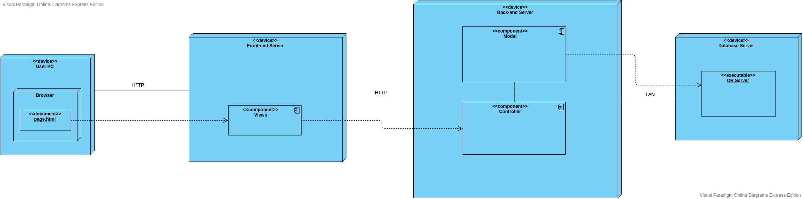

# Architecture "To be"  

Application type: web-application.  

Programming languages: Java, JavaScript.

Frameworks: Spring Boot, ReactJS.

Architecture type: client-server.

Reason for use: users need to access to data from different devices.  

Deployment strategy: distributed deployment - back-end, front-end and database will be launched from different stations.  

Technology choice: Spring Boot allows to quickly create REST-API. ReactJS gives a posssibility of creating user-friendly interface and processing images.

## Quality indicators  

### 1 Availability requirements
**Explanation.** Application should strave for minimal downtime.
**Rationable.** The longer the downtime, the less number of users. The fewer users, the less profit.   
**Measurement method.** Emulation of real application work and testing time of processing and responsability.

### 2 Scalability requirements
**Explanation.** Application can scale horizontally.   
**Rationable.** Probably many users will interact with application. The ability to scale is a prerequisite to provide service to the maximum number of users, which will give maximum profit.
**Measurement method.** Increase number of servers, test performance. 

### 3 Usability requirements

#### 3.1. Minimum interface elements
**Explanation.** Number of interface elements should be kept to a minimum.   
**Rationable.** The fewer interface elements, the less efforts a user needs to achieve the desired result.
**Measurement method.** Challenge QA engineers to find redundant interface elements.   
#### 3.2. Minimum actions
**Explanation.** Number of actions to achieve result should be kept to a minimum.   
**Rationable.** The fewer actions number, the less efforts a user needs to achieve the desired result.
**Measurement method.** Challenge QA engineers to count steps to achieve different results and find parts which can be reduced.
#### 3.3. Quick reaction
**Explanation.** Reaction time to achieve result should be kept to a minimum.
**Rationable.** The fewer reaction time, the less time a user needs to achieve the desired result.
**Measurement method.** Challenge QA engineers to count execution time.
#### 3.4. Authorization alert 
**Explanation.** Application should notificate users about successfully authorization.   
**Rationable.** User should know his status. If he is authorized - this point has to be defined. 
**Measurement method.** Challenge QA engineers to check authorization system. Try to log in from different devices and browsers. 

### 4 Extensibility requirements
**Explanation.** Resource service can be extended. For example, system might interact with other resources.
**Rationable.** Large list of features can attract customers which don't use the resource. It means that there will be more profit.
**Measurement method.** Try to add new feature and test workability.

### 5 Security requirements

#### 5.1. Administration/product owner security
**Explanation.** Only administrator or product owner are able to edit product information.  
**Rationable.** Copyright will be violated without this requirement.
**Measurement method.** Challenge information security department to find security weaknesses of the system.
#### 5.2. User security
**Explanation.** Only account owner is able to use account.
**Rationable.** Failure to comply with this requirement is likely to reduce trust in the resource and violate the principle of confidentiality and the law on copyright and related rights. 
**Measurement method.** Challenge information security department to find security weaknesses of the system.

### 6 Reliability requirements
**Explanation.** User's data can be recovered.
**Rationable.** Store user's data is necessary condition to resource existance. If user won't be able to store data, he won't use resource. It means that there is no profit.
**Measurement method.** Challenge information security department to put the system in a state of failure. Challenge QA to try recovering the system.

## Implementation ways

### 1 Logging  

This point allows to determine and fix bugs. Logging is implemented on the back-end.

### 2 Authorization & Authentication
User's data is stored in the database. All users use the same database. To provide access to a specific account, each user has a password. To access to account user has to enter his username and password.
User interacts with front-end. Front-end will send a data from user to back-end, which will process this data and give response.

### 3 Exception handling 
Application mustn't terminate and has to work correctly. If it neccessary, there will be exceptions and handlers of these.

### 4 Feedback
Resource must contain developer's or product owner's contacts.

# Architecture "As is"  

# Comparing

Both architures are the same, because these architectures are simple and can be launched in the same ways.

# Possible improvement

A few front-end servers can be launched to improve architecture. It'll ensure to divide calculating power on each server. This will speed up the service for each user.
