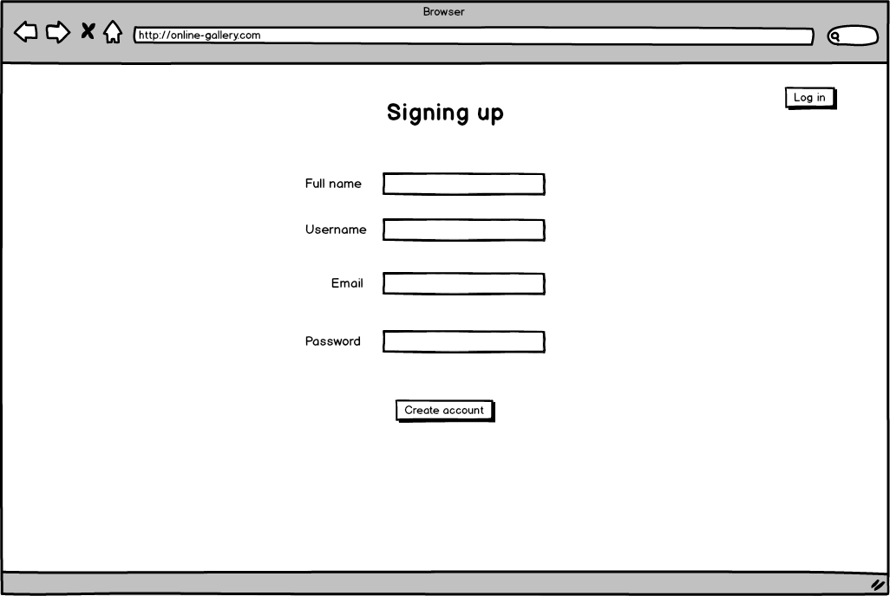
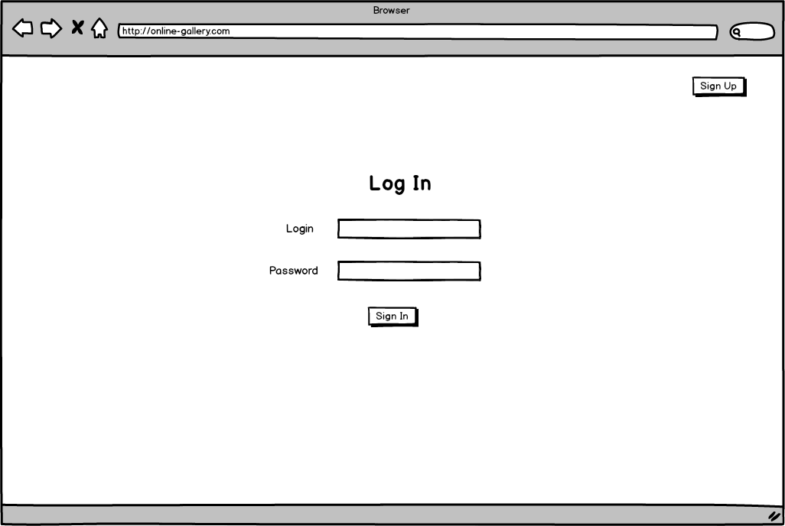
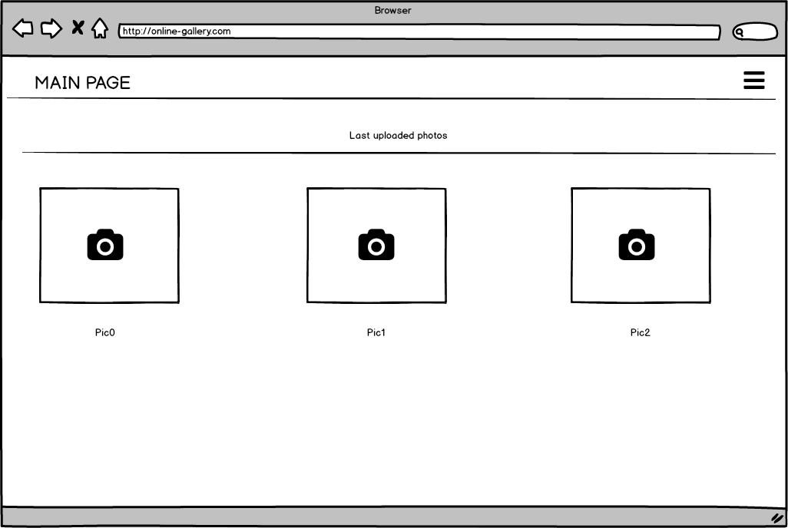
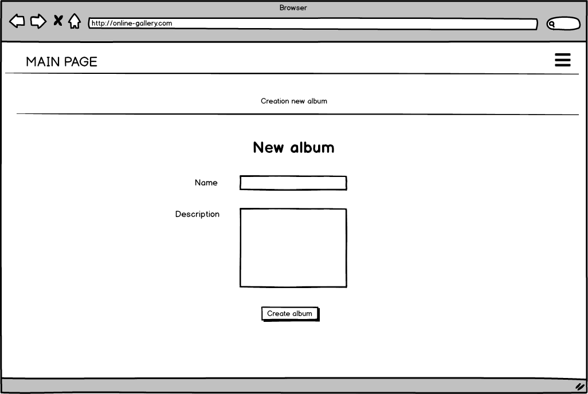
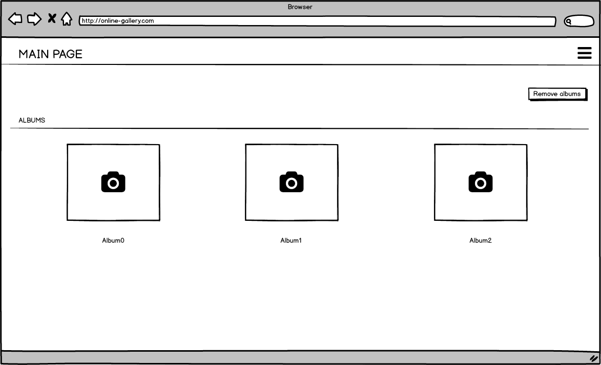
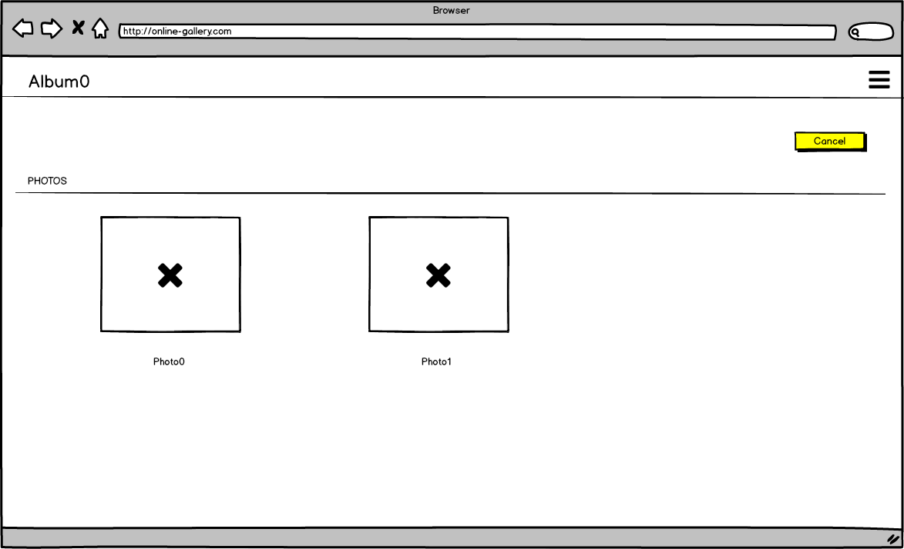
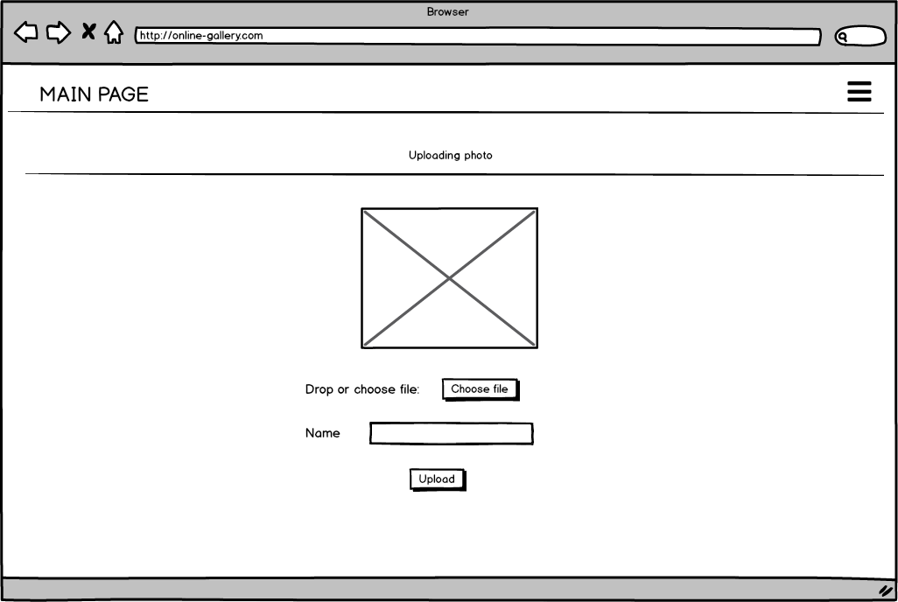

# Requirements for Online Gallery project

### Contents
1. [Introduction](#1)
  1.1. [Document purpose](#1.1)  
  1.2. [Source data](#1.2)  
2. [User Requirements](#2)  
  2.1. [Software Interfaces](#2.1)  
  2.2. [User Interfaces](#2.2)  
  2.3. [User Characteristics](#2.3)  
3. [System Requirements](#3)  
  3.1 [Functional Requirements](#3.1)  
  3.2 [Non-Functional Requierements](#3.2)  
    3.2.1 [Software Quality Attributes](#3.2.1)  
      3.2.1.1 [Usability requirements](#3.2.1.1)  
      3.2.1.2 [Security requirements](#3.2.1.2)  
    3.2.2 [Limitations](#3.2.2)  
 
### 1. Introduction 
#### 1.1. Document purpose 

This requirements are intended for developers of "Online Gallery" application. This document contains functional and non-functional requirements.

#### 1.2. Source data 

People’s love for technology has let businesses weave it—and themselves—into our lives, transforming the way we work, live and interact with the world. But in doing so they produce a lot of information. One of the part of this information are pictures. Pictures are needed to be stored anywhere, processed and shared. So more and more services with these possibilities appear. In the era of mobile phones these services should not only be adapted for PC but also such mobile phones.

### 2. User Requirements 
#### 2.1. Software Interfaces 

 This project uses **Java** as basic programming language. So, this application is created by **Spring Boot**. Front-end uses **ReactJS** of JavaScript languange. **MySQL** is here as Database.

#### 2.2. User Interfaces 

Registration view

Authorization view

Main page view

Create album view

Album list view

Album view

Uploading image view

#### 2.3. User Characteristics 

The target audience:

- Users that want to store images by cloud, share and edit them.

### 3. System Requirements 
#### 3.1. Functional Requirements 
##### 3.1.1. General functions 
###### 3.1.1.1 Authorization and registration 
**Description.** User can log in or register, if he has no account. 

| Function | Requirement | 
|:---|:---|
| User registration | Application has to give registration possibility for new users |
| Username already exists | Application has to propose to enter another username or reject action |
| Password doesn't meet the requirements | Application has to ask to enter another password or reject action |
| User's logging in | Application has to ask to enter username and password to authorize in the system |

###### 3.1.1.2 Album manipulation 
**Description.** Authorized user is able to add and delete album.

| Function | Requirement | 
|:---|:---|
| Adding album | Application has to give a possibility of adding album  |
| Removing album | Application has to give a possibility of removing album |

###### 3.1.1.3 Image manipulation 
**Description.** Authorized user is able to upload, download, remove and edit image. An image might be uploaded only into an album. Editing of image means filterizing, resizing, etc.

| Function | Requirement | 
|:---|:---|
| Uploading image | Application has to give a possibility of image uploading into server  |
| Downloading image | Application has to give a possibility of image downloading from server |
| Removing image | Application has to give a possibility of image removing from server |
| Editing image | Application has to give a possibility of image editing |

#### 3.1.2. Limitations 

1. There is no possibility to interact with application without internet-connection.
2. Only latin charachters can be used.

### 3.2 Non-Functional Requierements 
#### 3.2.1 Software Quality Attributes 

Since this is web application it can be launched by PC or mobile phone. It's quite straightforward approach in using the application so users need only basic knowledge working with PC. Users personal data encoded inside the application.

##### 3.2.1.1 Usability requirements 

1. Material Design controls used for modern view.
2. All interface elements are clear and have description or simple view.

##### 3.2.1.2 Security requirements 

1. Regular user is unable to access database inforamation.
2. Personal data is encrypted. User's passwords are saved in the database as hash.

#### 3.2.2 Limitations 

1. The application requires Java 1.8
2. The application requires Spring Boot 2.2.6
3. For interaction with application database instance should be correct configured.
