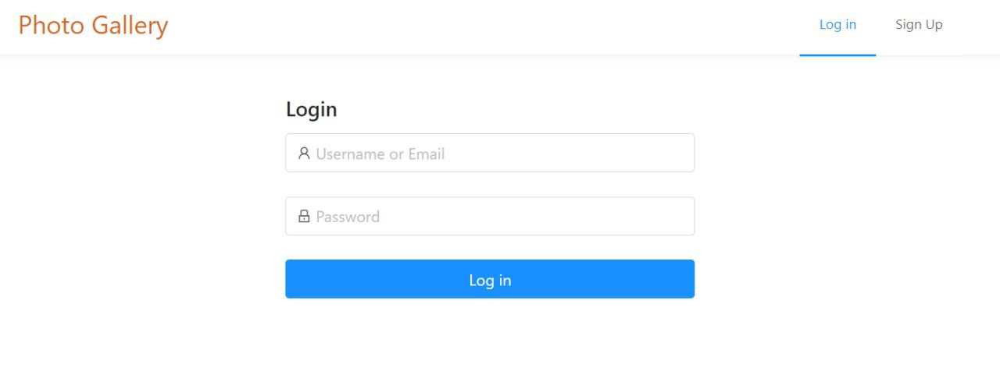
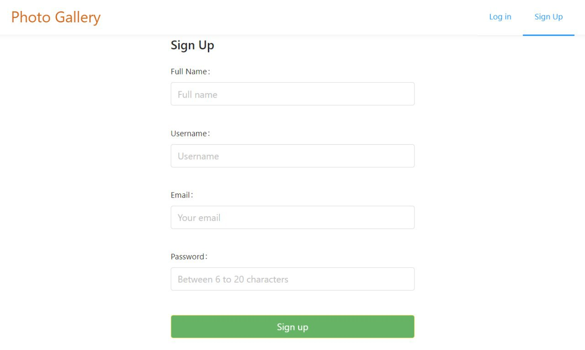
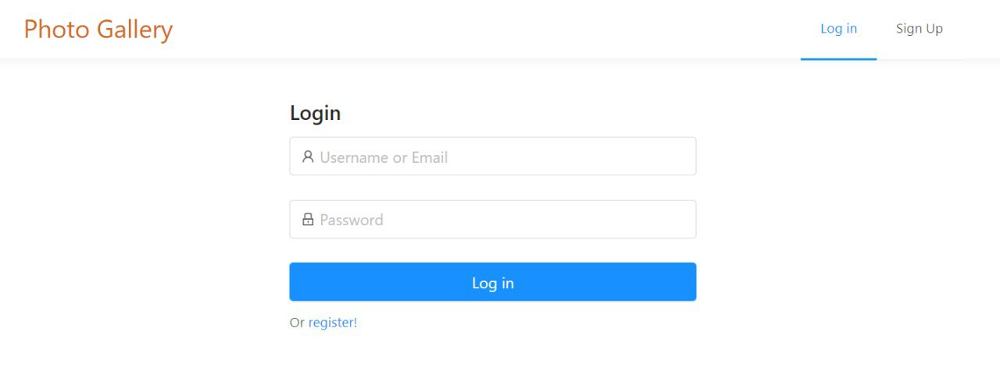
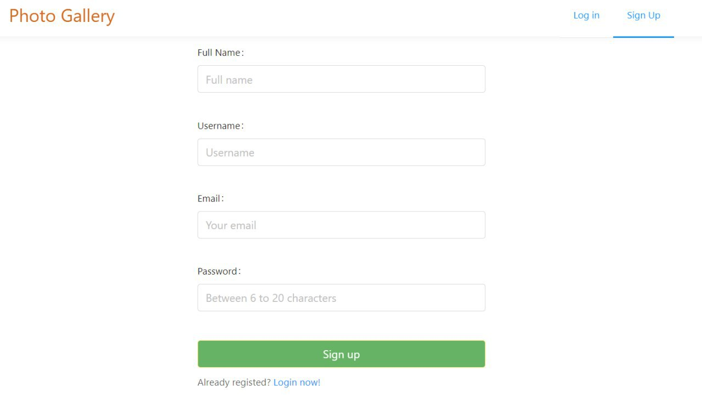
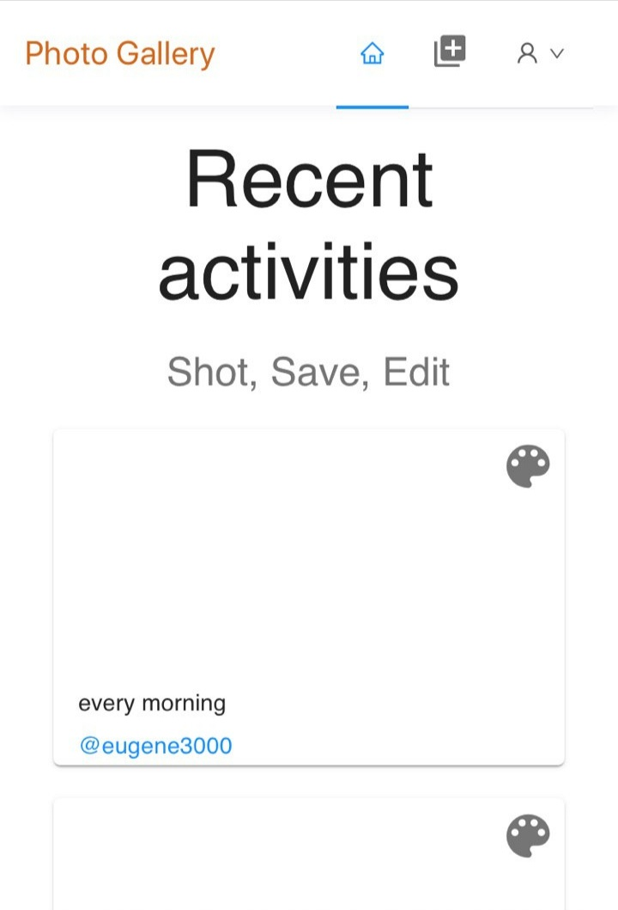
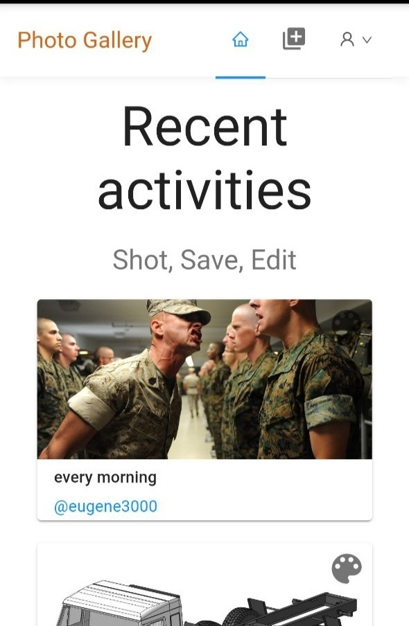

# UX Improvement

## Software quality evaluation:
### 1. Recognizability of conformity
When user is joining us, he goes to the main page, where he can find recent uploaded pictures from other users. It's a way to recognize this resource. Also user is able to see "Log in" and "Sign in" buttons.
### 2. Trainability
There is no instruction of usage this resource, because interface is friendly, intuitive and understandable. New user won't get any problems with application. If after all he found it difficult to use, he is able to contact support.
### 3. Usability
The interface is designed so that the user can intuitively understand which button to press in a particular situation.
### 4. User mistakes protection
Service of user mistakes protection exists. If user will enter incorrect data, he will be notificated about mistake.
### 5. GUI aesthetics
The GUI follows a uniform design style, which helps make the product look fabulously beautiful and minimalistic.
### 6. Availability
All interface elements are clear and have description or simple view. As well, this resource is adapted for mobile devices. All people, who have any device, which has application as browser and internet connection, are able to use resource. 
### Conclusion
#### Ways to improve UX:
* Full adapting for mobile devices.
* Logging/Signing in pages refactoring.
* Up bar refactoring.

## Improvement examples
* ### Adding possibility of logging in during registration. The same story about signing up.
#### Before

#### After

* ### Mobile device adapting
#### Before

#### After

* ### Making button on the upbar is clickable

